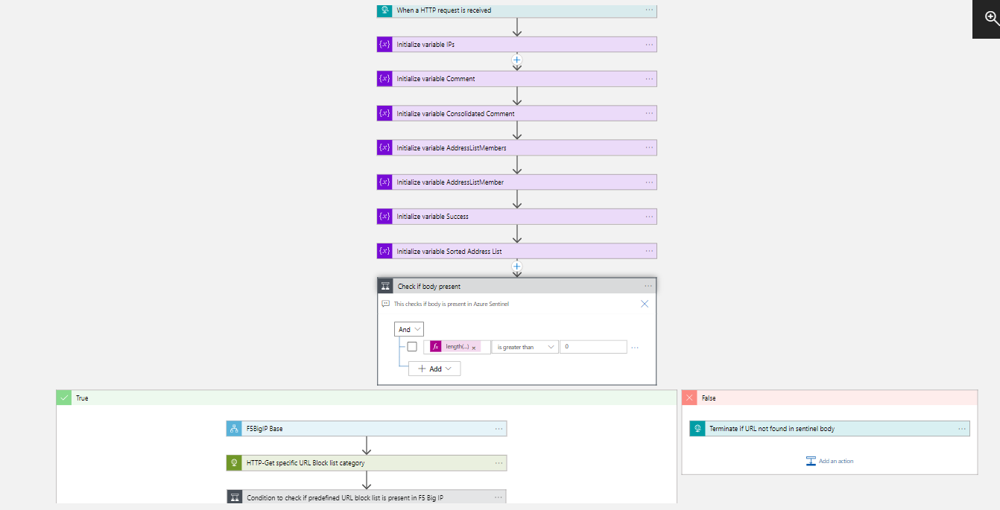
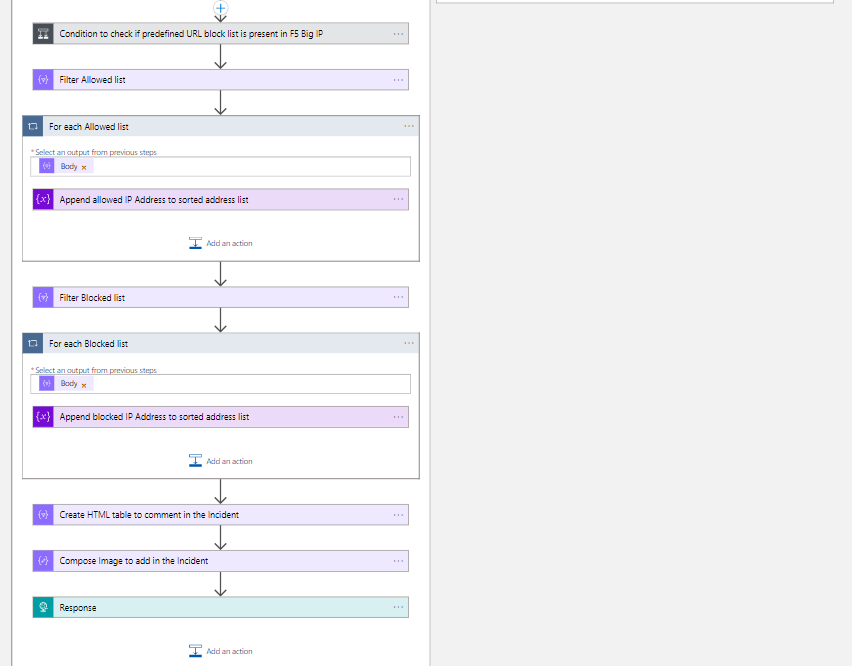
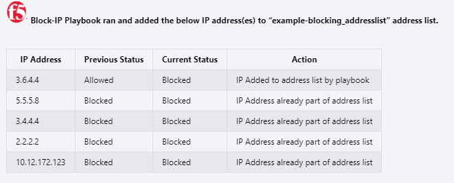

# F5 BIG-IP Block IP Playbook

## Summary
 When this playbook gets triggered performs the below actions:
 1. Fetches a list of potentially malicious IP addresses.
 2. For each IP address in the list, checks if the IP address is present in IP Address list of F5 BIG-IP firewall.
 3. If IP address not present in IP address list, then adds the IP address to IP address list.

 

 ## Pre-requisites for deployment
1. Deploy the F5 BIG-IP Base Playbook before the deployment of this playbook under the same subscription and same resource group and under the same location/region. Capture the name of the playbook during deployment.
2. A Firewall policy rule should be created for blocking of IP.
3. An address list should be created for blocking IP.
4. The address list should be a part of Firewall policy rule.

## Authentication

* The REST APIs used by the playbook requires API Key access token which is generated by base playbook. The access token expires every 20 minutes. To be authenticated by the F5 Big IP resource, the access token (X-F5-Auth-Token) must be included with header in a REST API request.

## Deploy Base Playbook

 Deploy the base playbook by clicking on "Deploy to Azure" button. This will take you to deploying an ARM Template wizard.

 

 ## Deployment Instructions
 1. Deploy the playbook by clicking on the "Deploy to Azure" button. This will take you to deploy an ARM Template wizard.

 
  

 2. Fill in the required parameters for deploying the playbook.

 | Parameter  | Description |
| ------------- | ------------- |
| **Playbook Name** | Enter the playbook name here without spaces |
| **Base Playbook Name**|Enter the name of base playbook without spaces |
| **IP Address List Name** | Enter IP Address List name to block IP |

# Post-Deployment Instructions 
## Configurations in Sentinel
- In Azure sentinel HTTP trigger should be configured to have body with IP addresses.

# Playbook steps explained
## When HTTP request is received
  Captures potentially malicious or malware IP addresses incident information.

## Initialize variable IPs
  Get the list of IPs from the trigger.

## Generate Access Token
 Call base playbook to generate access token.

 ## Check if IP Address List exists
 * If IP address list exists, then for each malicious IP check if that IP is part of IP address list.
 * If IP address list does not exist, gets responded with error IP address list not found.

## For each malicious IP received from the incident
 - Checks if the IP address is part of IP address list.
  - If IP address is part of IP address list, then incident comment is created saying IP address is blocked.
  - If IP address is not part of IP address list, then add the IP address to IP address list for blocking in firewall. Incident comment created saying IP added to IP address list by playbook.
  - Incident Comment from both cases are combined.

- Update the incident with status close.

## Incident comment 

