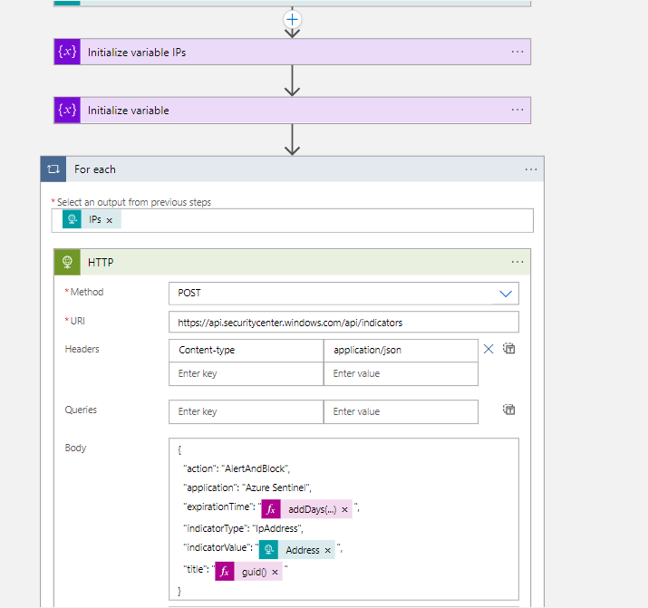
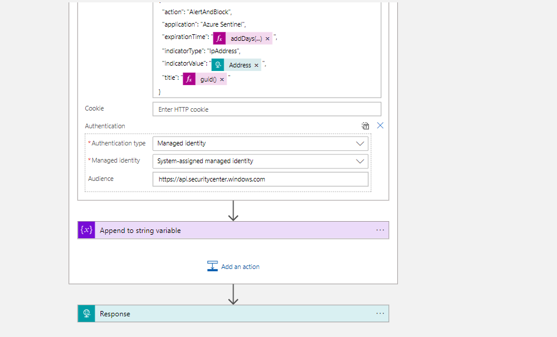

# Restrict-MDEIpAddress
author: Nicholas DiCola

This playbook will take IP entities and generate alert and block threat indicators for each IP in MDE for 90 days.

## Quick Deployment
**Deploy with HTTP trigger**


[](https://portal.azure.com/#create/Microsoft.Template/uri/https%3A%2F%2Fraw.githubusercontent.com%2FAzure%2FAzure-Sentinel%2Fmaster%2FPlaybooks%2FRestrict-MDEIPAddress%2Fincident-trigger%2Fazuredeploy.json)
[](https://portal.azure.us/#create/Microsoft.Template/uri/https%3A%2F%2Fraw.githubusercontent.com%2FAzure%2FAzure-Sentinel%2Fmaster%2FPlaybooks%2FRestrict-MDEIPAddress%2Fincident-trigger%2Fazuredeploy.json)

## Prerequisites
- **For Gov Only** You will need to update the HTTP action URL to the correct URL documented [here](https://docs.microsoft.com/microsoft-365/security/defender-endpoint/gov?view=o365-worldwide#api)
- You will need to grant Ti.ReadWrite permissions and assign Microsoft Seninel Reader to the resource group for the managed identity.  Run the following code replacing the managed identity object id, subscrptiptionid and resource group.  You find the managed identity object id on the Identity blade under Settings for the Logic App.
```powershell

$MIGuid = "<Enter your managed identity guid here>"
$SubscriptionId = "<Enter your subsciption id here>"
$ResourceGroup = "<Enter your resource group here>"
$MI = Get-AzureADServicePrincipal -ObjectId $MIGuid

$MDEAppId = "fc780465-2017-40d4-a0c5-307022471b92"
$PermissionName = "Ti.ReadWrite" 
$RoleName = "Microsoft Sentinel Responder"

$MDEServicePrincipal = Get-AzureADServicePrincipal -Filter "appId eq '$MDEAppId'"
$AppRole = $MDEServicePrincipal.AppRoles | Where-Object {$_.Value -eq $PermissionName -and $_.AllowedMemberTypes -contains "Application"}
New-AzureAdServiceAppRoleAssignment -ObjectId $MI.ObjectId -PrincipalId $MI.ObjectId `
-ResourceId $MDEServicePrincipal.ObjectId -Id $AppRole.Id

New-AzRoleAssignment -ObjectId $MIGuid -RoleDefinitionName $RoleName -Scope /subscriptions/$SubscriptionId/resourcegroups/$ResourceGroup
```

## Screenshots


